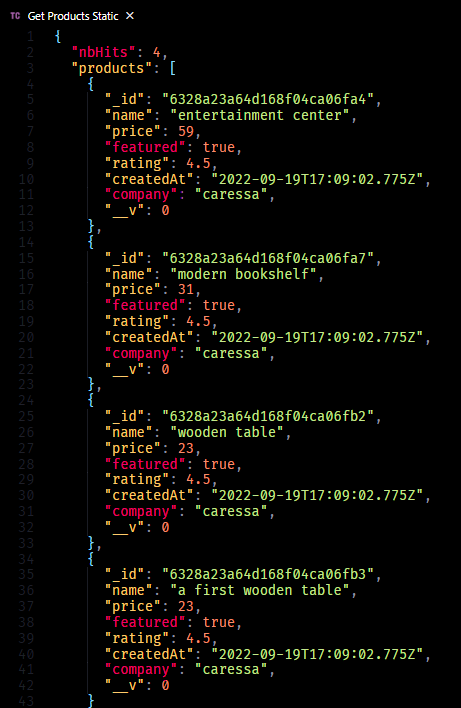

# Store API

Store API built with Express.js & MongoDB.

## HTTP Methods

- Get all products static &nbsp; &nbsp; `GET /api/v1/products/static`
- Get all products &nbsp; &nbsp; &nbsp; &nbsp; &nbsp; &nbsp; &nbsp; `GET /api/v1/products`

## Demo

`populate.js` used to to add `products.json` to the database (MongoDB).

```
$ node populate.js
```

In `controllers/products.js`

```js
const getAllProductsStatic = async (req, res) => {
  const products = await Product.find({ company: 'caressa', featured: true });
  res.status(200).json({ nbHits: products.length, products });
};
```

The result of `GET /api/v1/products/static` _Gets all products that are from caressa and is featured._



_Enjoy 🤍_
